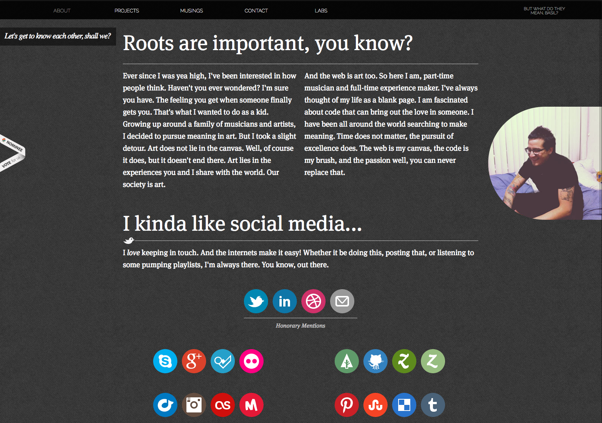
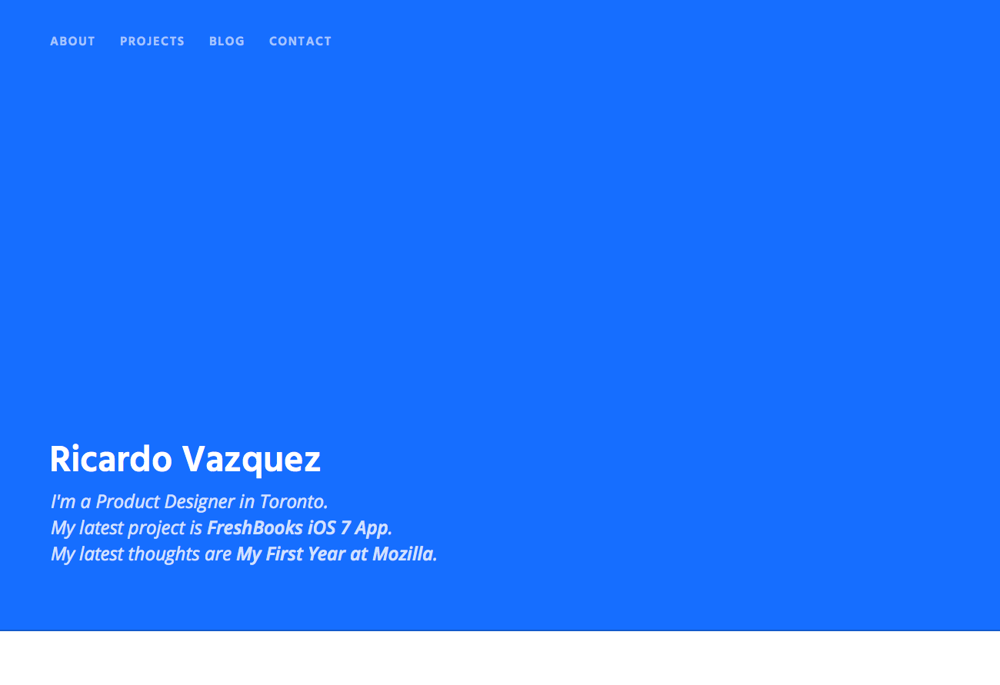
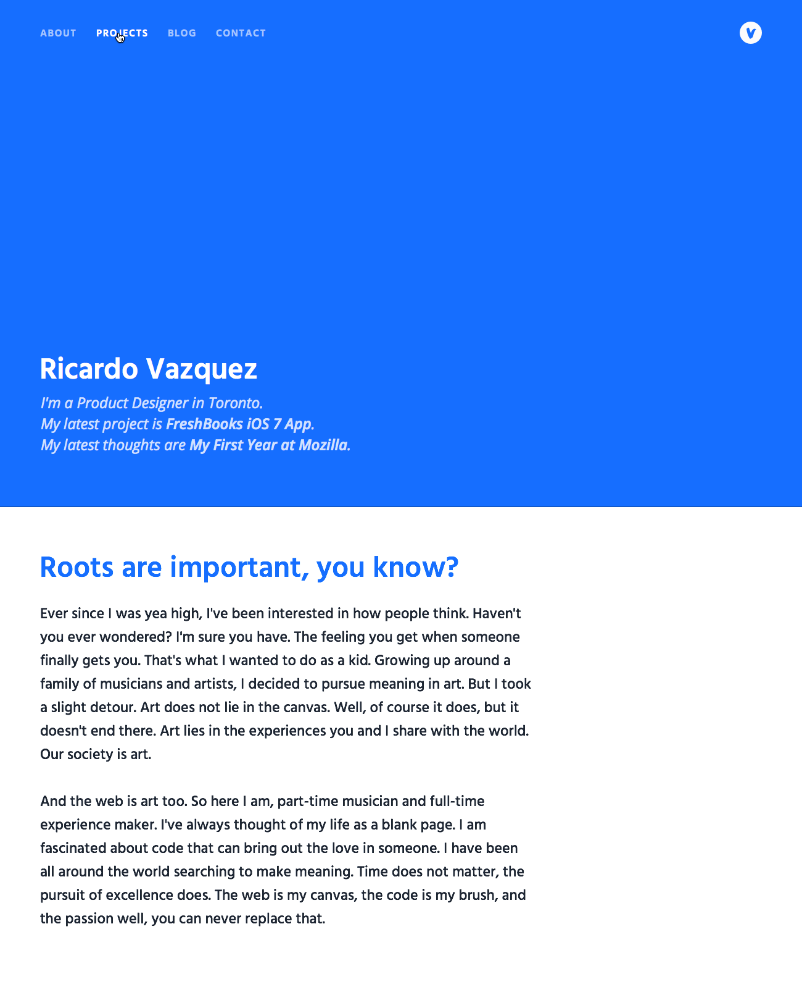
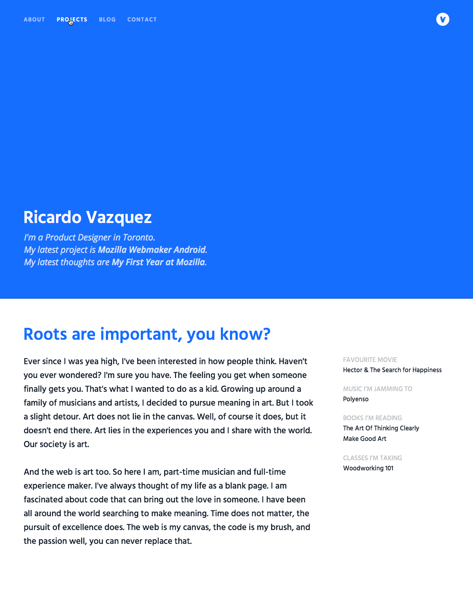
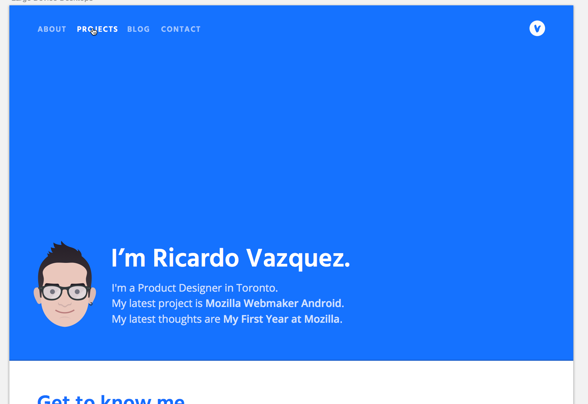
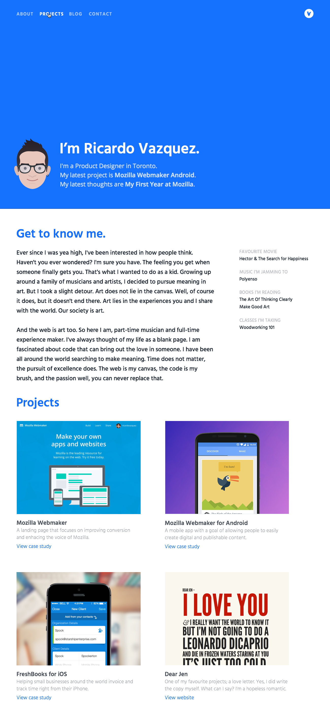

# Website Redesign

I want to document the redesign of my website.

My website looks like this at the moment:  

I like it. It works well. But I am looking for something new.

Here we go.

---

#### Friday August 7th, 2015

- I want something clean, with minimal colours (2 max).
- I want clean typography and legible text.
- I want beautiful imagery.
- I want a single page website, but separate project pages.
- I want a friendly but elegant tone.
- I want to explore layout options, go with something funky. Why not?

- Blue background would span the height of the viewport

---

- Finessing things over.
- Adding some navigation.

---

- Added wordmark
- Hover state on navigation
- Started to design the content section. I like the big text, but the layout might change.
- Content is the same as my current website. That will change, but for now it should work :)

---

- I like where this is going. Adding a section on the right with quick facts.

---

#### Thursday September 10th, 2015

- My colleague Sabrina Ng made an awesome illustration of me, I want to use it! What do you think?

---

#### Thursday September 18th, 2015

- I'm starting to work on the Projects section of the site. I think it looks nice and clean. Maybe I need to bump up the px value of the text.

